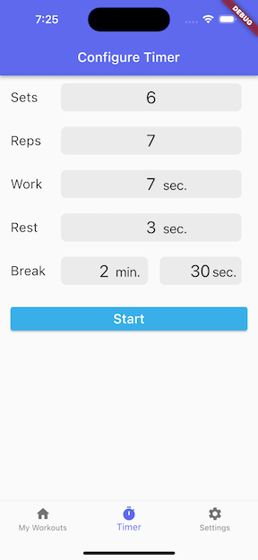
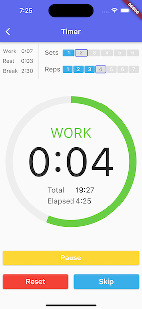
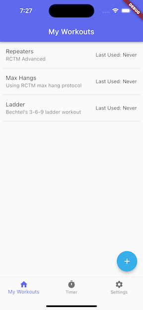
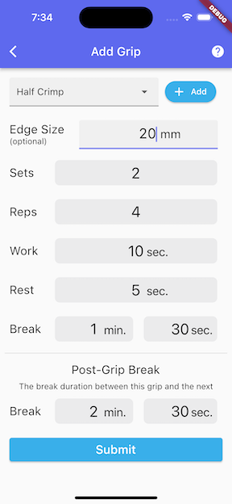
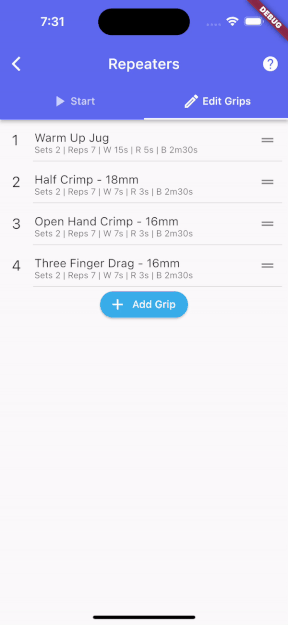
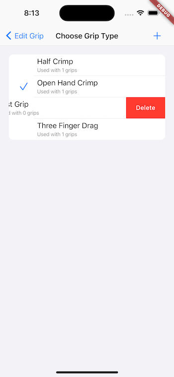

# CountDown - an iOS App

A tool for rock climbers to create their own custom hangboard workouts.

This app is currently in progress. The end goal is to build an open-source application launched to the iOS App Store.

## Current Progress

All source code for is located in the /lib directory, as standard for Flutter projects.  
The below screenshots highlight the main functioality of the app implemented so far.  

Custom Timer Configuration  
  

Countdown Timer  
  

Create Custom Workouts  
  

Create Custom Grips  
  

Re-sequence Custom  
  

Create Custom Grip Types  
  
