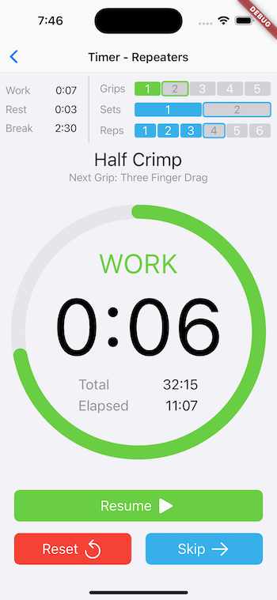
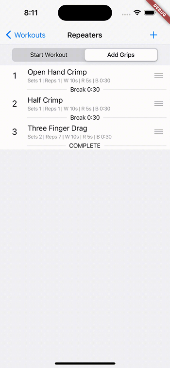

# CountDown - an iOS Hangboard Timer

A tool for rock climbers to create and execute their own custom hangboard workouts.

## App Functionality
- Features a simple, user-friendly, interface that allows users to quickly and easily navigate the app
- Users can create and build custom hangboard workouts
- Users can create, delete, modify, duplicate, and reorder grips for a particular workout
- Workouts can be executed on the countdown timer, which simply and effectively depicts all information relevant to a hangboard workout
- Users have the ability to turn off/on sound and vibration, and choose from a variety of different timer noises
- Ad-hoc timer workouts can be executed without the need to build a new workout

## Current Progress

The app is currently in it's final stages and is in beta testing on Apple's TestFlight service. Deployment to the App Store is currently held due to high CPU requirements needed to run the timer animation. While everything functions as designed, the timer countdown animation causes high energy usage and leads to excessive device heating on some iPhones. This is a known issue with the Flutter framework, as detailed by this GitHub issue: https://github.com/flutter/flutter/issues/13203. Attempts to optimize the animation have not reduced CPU requirements enough to release the app.

Alternative approaches are currently being explored for the animation, possible involving re-writing the app using the native Swift language, which is significantly more performant. Although tedious, this solution may prove best for users in the long-term.

All source code for is located in the /lib directory, as standard for Flutter projects. 

The below screenshots highlight the main functionality of the app.  

***************
Countdown Timer  
  

***************
Custom Timer Configuration  
  

***************
Create Custom Workouts  
  

***************
Create Custom Grips  
  

***************
Re-sequence Custom Grips  
  

***************
Create Custom Grip Types  
  

***************
Adjust Timer Settings  
  
