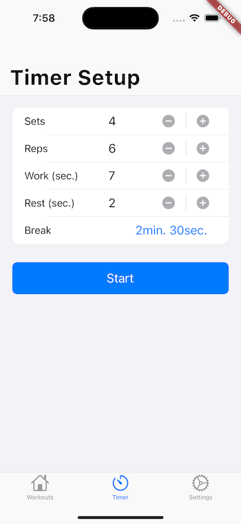
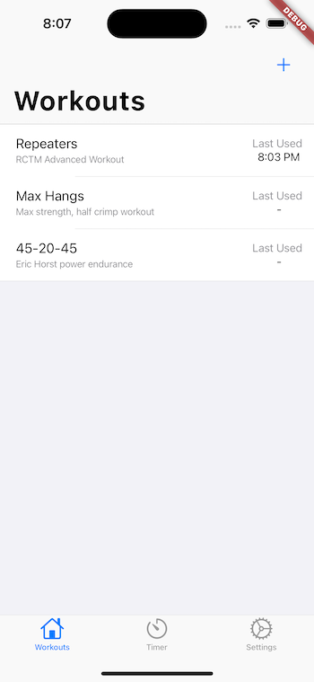
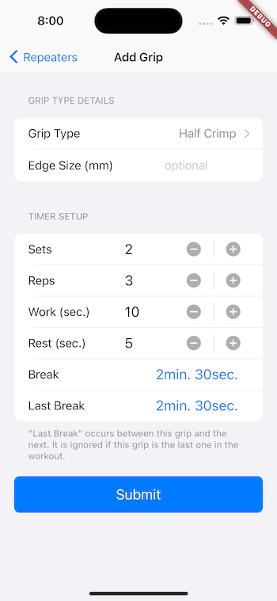

# CountDown - an iOS App

A tool for rock climbers to create their own custom hangboard workouts.

This app is currently in progress. The expected deployment date to the iOS App Store
is August 2023.

## Current Progress

All source code for is located in the /lib directory, as standard for Flutter projects.  
The below screenshots highlight the main functionality of the app.  

***************
Countdown Timer  
  

***************
Custom Timer Configuration  
  

***************
Create Custom Workouts  
  

***************
Create Custom Grips  
  

***************
Re-sequence Custom Grips  
  

***************
Create Custom Grip Types  
  

***************
Adjust Timer Settings  
  
